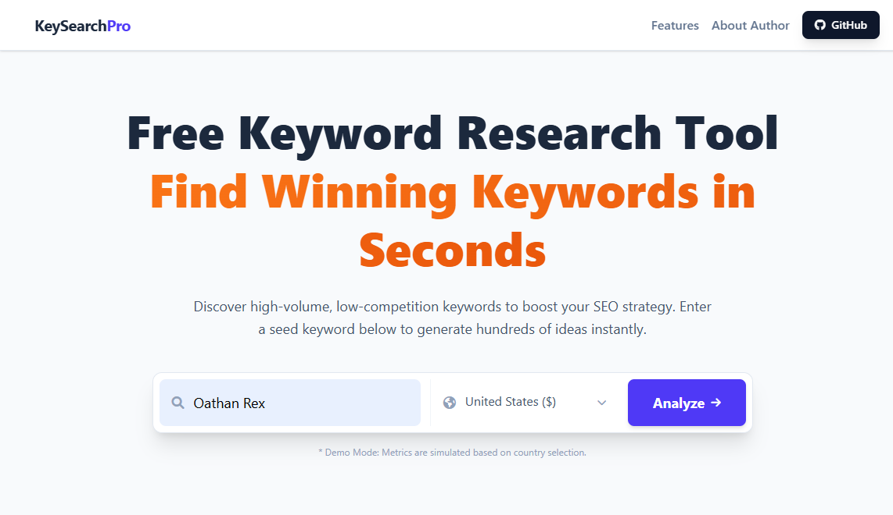

# 🚀 KeySearchPro – Free Keyword Research Tool (Unlimited)

**KeySearchPro** is a powerful, free, and unlimited keyword research tool designed for SEO professionals, digital marketers, bloggers, and content creators.  
It helps you discover **high-volume, low-competition keywords** with detailed metrics like Search Volume, CPC, Keyword Difficulty, and Search Intent — all without sign-up.

🔗 **Live Demo:**  
👉 https://oathanrex.github.io/keysearchpro/

---

## ✨ Features

- 🔍 **Unlimited Keyword Research** – No daily limits, no login required  
- 📊 **Detailed SEO Metrics**
  - Search Volume
  - CPC (Country-based currency)
  - Keyword Difficulty (KD %)
  - Search Intent (Informational, Commercial, Transactional, Navigational)
- 🌍 **Multi-Country Support** – US, UK, India, Europe, Asia & more
- ⚡ **Instant Analysis** – Results generated in seconds
- 📥 **CSV Export** – Download keywords for further SEO analysis
- 🧠 **Smart Filtering**
  - Easy keywords (Low KD)
  - High volume keywords
- 📱 **Responsive UI** – Works on desktop, tablet, and mobile
- 💯 **Completely Free & Open Source**

---

## 🛠️ Built With

- **HTML5**
- **Tailwind CSS**
- **Vanilla JavaScript**
- **Font Awesome**
- **GitHub Pages**

No backend. No database. Fully client-side and blazing fast.

---

## 📸 Preview

> *Note: Metrics are currently simulated (Demo Mode). Real API integration planned.*

---

## 🚀 How to Use

1. Open the tool:  
   👉 https://oathanrex.github.io/keysearchpro/
2. Enter a **seed keyword** (e.g. `vegan recipes`)
3. Select a **country**
4. Click **Analyze**
5. Filter, sort, and export keywords as CSV

---

## 📈 SEO Use Cases

- Find low-competition keywords for blog posts
- Validate keyword ideas before content creation
- Discover transactional keywords for affiliate sites
- Analyze keyword intent for content strategy
- Quick keyword research without paid tools

---

## 🧩 Roadmap (Planned Features)

- 🔗 Real keyword data integration (Google / DataForSEO / RapidAPI)
- 📅 Monthly search trends
- 🔐 User accounts & saved projects
- 💰 Google AdSense monetization
- 📱 PWA (Installable SEO Tool)
- 🌐 Custom domain support

---

## 🧑‍💻 Author

**Oathan Rex**  
SEO Tool Developer | Frontend Engineer  

- GitHub: https://github.com/oathanrex
- Portfolio: https://oathanrex.github.io/

---

## 📄 License

This project is licensed under the **MIT License**.  
You are free to use, modify, and distribute it with attribution.

---

## ⭐ Support

If you find this project useful:
- ⭐ Star the repository
- 🍴 Fork it
- 🐛 Report issues
- 💡 Suggest features

Your support helps this project grow 🚀
